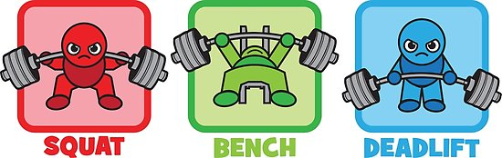

#Instructions: 
1) Install the package rmdformats by running :
install.packages("rmdformats")
2) Because of the size of certain files, we decided to make them available on google drive: 
You can retrieve the 3 different files with the followers for a subset of profiles of powerlifters here :
* insta: https://drive.google.com/open?id=1Ce6VrLjzP4VWG9gsKXX9N2k6-zhwf2yk
* insta2: https://drive.google.com/open?id=1VOIxQXXZ2zZ5xnTIqZA8TUU0lncc3a-F
* insta3: https://drive.google.com/open?id=1UrguUyX0ezVroB-5nC9b6RdkjOu7Zagr


```{r setup, warning = FALSE, message = FALSE, echo=FALSE }
library(knitr)
library(tidyverse)
library(lubridate)
library(modelr)
library(broom)
library(ggrepel)
library(forcats)
library(here)
library(gtools)
library(kableExtra)
library(magrittr)
library(caret)
library(readr)
library(RColorBrewer)
library(dplyr)
library(gridExtra)
library(ggplot2)
library(sf)
library(hms)
library(scales)
library(arm)
library(naniar)
library(ggmap)
library(tmaptools)
library(utf8)
library(dplyr)
library(lubridate)
library(stringr)
library(tidyr)
#library(tally)
library(forecast)
library(caret)
library(devtools)
library(plotly)
library(car)
library(DT)
library(shiny)
library(jpeg)

options(encoding="utf-8")

theme_set(theme_bw())
knitr::opts_chunk$set(fig.align = "center", message = FALSE)
```

# Overview and Motivation

<p align='justify'> As we are both interested in sports, especially weightlifting, we would like to know more about powerlifting and the population of powerlifters in general. We also want to see where there are the most powerlifting competitions, and if competitions and/ or performance have any impact on the social media following of the powerlifters. Indeed, social media being such a new technology and even a new market with new jobs, we thought it would be interesting to see if the success on Instagram for example would be explained by real performance in the sports, or more by pictures, attractiveness or some marketing techniques. More generally, we are interested in seing if there is any strong relationship between bodyweight and strength, if it is possible to predict strength given a set of different features (age, gender, equipment,…) , and dive into powerlifting data in general to learn more about a discipline we like.</p>


# Related Work

<p align='justify'> Both of us were interested in fitness and powerlifting competitions before the course started for different reasons. Alexandre is already fond of sports and powerlifting disciplines, whereas Rita is interested in health and overall muscle gain for personal reasons. We tried to look at a subject which would allow us both to be interested and really involved in the project, and after browsing on Kaggle and finding this database, we thought it would be a good idea to dive a little more into this topic. </p>
 
#Initial Questions: 
What questions are you trying to answer? How did these questions evolve over the course of the project? What new questions did you consider in the course of your analysis?

Our initial questions were
<br>

1) To graphically summarize the population of powerlifters and to draw meaningful conclusions, to use different features such as gender, bodyweight, height and age and to try to predict the performance (predicting best squat, best deadlift and best bench press).  

 2) It would also be interesting to measure the physical statistics of the lifters (Age, Sex, Weight) and see if there is a link with their Wilks points.  

 3) We could also see if the weight/competition categories as they are today are coherent for comparison between lifters or if other divisions would make more sense.  

 4) We wanted to make a link between federations and exercises performances, and see if some federations attracts a certain type of powerlifter.  

 5) Then, we would also analyze the evolutions of the overall performances through time for a given lifter and see if any unexpected (or expected) pattern occurs. We would select lifters who have more than a certain amount of entries, but we have not yet decided this benchmark.  

 6)It would be interesting to extract the number of Instagram followers per powerlifter, and see if we can draw conclusions between their popularity, performances, federations and exercises.  

 7) Finally we wanted to make a visual representation in the form of a map of the different powerlifting contests. In one of the databases we have the places of the competitions. With the help of OpenStreetMap, we thought of extracting the coordinates of those competitions and represent them as a point on a world map.  It would allow us to see in a visual manner the density of contests and the most popular places/countries to compete in.   


<p align='justify'>When doing the exploratory analysis, we saw that question 3) is not possible to answer as such. Indeed, we see that the lifters adapt to the constraint of the weight division, and try to get to the heaviest weight possible in their division.  However, it raised the following question:   </p>

<p align='justify'>3bis) Is it really an advantage to be the heaviest in one competing division, more precisely, in the most popular competing divisions, as they vary a lot from one competition/federation to another ?</p>


<p align='justify'>When further working on the  question 5), we found the following things:     
-Not a lot of powerlifters participated enough times to have a very thorough following of their progression  
-They do not compete on the same years, for the same duration, at the same frequence and do not perform the same exercises.   
Therefore, we could not compare the powerlifters between them to generate a model, and did not have enough data on a specific powerlifter to create a personal modal.   
Instead, we decided to analyse the 5 powerlifters who compete the most and see if we can deduct anything from this analysis.   
Therefore the question 5bis is now: Then, we would also analyze the evolutions of the overall performances through time for the 5 lifters that competed the most, and see if we can deduct something on the evolution of their performance.</p>    

**So our final set of questions to answer is:**
<br>
<span style="color:blue">
<p align='justify'> 1) To graphically summarize the population of powerlifters and to draw meaningful conclusions, to use different features such as gender, bodyweight, height and age and to try to predict the performance (predicting best squat, best deadlift and best bench press).</p> 

<p align='justify'> 2) It would also be interesting, also to measure the physical statistics of the lifters (Age, Sex, Weight) and see if there is a link with their Wilks points.</p> 

<p align='justify'> 3) Is it really an advantage to be the heaviest in one competing division, more precisely, in the most popular competing divisions, as they vary a lot from one competition/federation to another ?</p>

<p align='justify'> 4)	We wanted to make a link between federations and exercises performances, and see if some federations attracts a certain type of powerlifter.</p>

<p align='justify'> 5) Then, we would also analyze the evolutions of the overall performances through time for the 5 lifters that competed the most, and see if we can deduct something on the evolution of their performance.</p>

<p align='justify'> 6)	It would be interesting to extract the number of Instagram followers per powerlifter, and see if we can draw conclusions between their popularity, performances, federations and exercises.</p>

<p align='justify'> 7)	Finally we wanted to make a visual representation in the form of a map of the different powerlifting contests. In one of the databases we have the places of the competitions. With the help of OpenStreetMap, we thought of extracting the coordinates of those competitions and represent them as a point on a world map.  It would allow us to see in a visual manner the density of contests and the most popular places/countries to compete in.</p>  
</span>


# Data

## A short explanation
###Squat & bench & deadlift
<p align= 'justify'> In this section, we would like to explain the different lifts we will talk about in this work. The 3 main lifts performed during powerlifting competition are the: </p>
* **squat**: a lift involving a squat done while holding a barbell on the shoulders. This exercise mainly targets the quadriceps, hamstrings, abdominals, glutes and back for stabilization. 
* **bench press**: a lift or exercise in which a weight is raised by extending the arms upward while lying on a bench. This lift works the pectoralis, the deltoids and the triceps. 
* **deadlift**: a lift in weight lifting in which the weight is lifted from the floor to hip level. This movement works the posterior chain (trapezius, latissiumus dorsi, glutes, hamstrings).

<center>

</center>

###Wilks coefficient
<p align='justify'>The Wilks Coefficient or Wilks Formula is a coefficient that can be used to measure the strength of a powerlifter against other powerlifters despite the different weights of the lifters. It is given by the following formula:  </p>
$$Coeff = \frac{500}{a + bx + cx^2 + dx^3 + ex^4 + fx^5}$$

####Coefficients 

<center>
Parameter|Men|Women
-|--|------
a|-216.0475144 |594.31747775582
b|16.2606339|-27.23842536447
c|-0.002388645|0.82112226871
d|-0.00113732|-0.00930733913
e|7.01863E-06|4.731582E-05
f|-1.291E-08|-9.054E-08
</center>
## Meetings

### Importing the data

<p align= 'justify'>The second table is the one with the meetings. It has 8482 entries, and each entry has a MeetID ( which is the same as for the powerlifters’ database), the meet path, the federation of the meet, the date of the meet, the country, state and town of the meet and finally the meet name.  </p>
<p align= 'justify'>From this database, we want to use the MeetID, the date, the country, the federation,  the state , the town and the name of each meeting. </p>

```{r , warning = FALSE, message = FALSE, echo=FALSE }
meetings<-read.csv("../data/meets.csv", sep=",")
 
meetings%>%
  head()%>%
  kable(digits = 1,
        caption = "Powerlifting meetings raw data",
        format="html",
        align = 'c')%>%
  kable_styling(bootstrap_options = c("striped"), 
                full_width = T, 
                font_size= 12)%>%
  scroll_box(width = "700px", height = "300px")

```

### Clean the data

<p align='justify'>We put the format of the date as year-month-day. And put the meetings'towns in characters.  </p>
<p align='justify'>We select the complete lines of the table, and create two columns. One with the meetings'towns trimmed (with no white space), and the other one with the location, adding the country to the meeting towns. This last column is meant to be used when computing the worldmaps and US maps later.  </p>

```{r , warning = FALSE, message = FALSE, echo=FALSE , results='hide', include=FALSE}
str(meetings)

meetings$Date <- as.Date(meetings$Date, format = "%Y-%m-%d")
meetings$MeetTown <- as.character(meetings$MeetTown)

meetings <- meetings %>%
  filter(complete.cases(MeetTown)) %>%
  mutate(MeetTown = str_trim(MeetTown)) %>%
  mutate(location = paste(MeetTown, MeetCountry, sep = ", "))
```

```{r , warning=FALSE, message=FALSE, echo=FALSE}
meetings%>%
  head()%>%
  kable(digits = 1,
        caption = "Powerlifting meetings clean data",
        format="html",
        align = 'c')%>%
  kable_styling(bootstrap_options = c("striped"), 
                full_width = T, 
                font_size= 12)%>%
  scroll_box(width = "700px", height = "300px")

meets<-meetings %>%
  dplyr::select(MeetID, MeetName , Date , Federation , MeetPath)

meets$Date<-ymd(meets$Date)

```

## Powerlifters

Data source : Kaggle **openpowerlifting 2018** data :  
https://www.kaggle.com/dansbecker/powerlifting-database.

### Data importation

<p align= 'justify'>The powerlifter data has two tables. The first one is only on the lifters data. It is a csv file with 386 414 entries. Each entry has a MeetID which corresponds to a code identifying a specific competition, the lifter’s name , the sex of the powerlifter, the equipment used, the age of the powerlifter, his division ( competition category), his bodyweight in kg, his weight-class in the competition, his fourth attempt for a squat, his best squat, his fourth attempt for a bench , his best bench, his fourth attempts for a deadlift, his best deadlift, the total of kg lifted by this lifter during this meeting, his place (ranking) and his Wilks points.
From this specific powerlifters’ database, we intend to use the MeetID, the name, the sex, the bodyweight, the weight-class, the equipment, the best squat, the best bench, the best deadlift, the place (ranking) and the Wilks. Upon first inspection of this table we see some implicit NAs so the first thing we do, during the import of the table, is to replace them by explicit NA.</p>

*Below a view of the raw data but with explicit NAs :*
```{r , warning = FALSE, message = FALSE, echo=FALSE }

##We import the database and make the implicit NA explicit
powerlifters<-read.csv("../data/openpowerlifting.csv", sep=",", na.strings=c(""," ","NA", "NaN", "nan", "N/A", "na"))

##View of what it looks like 

powerlifters%>%
  head()%>%
  kable(digits = 1,
        caption = "Powerlifters raw data",
        format="html",
        align = 'c')%>%
  kable_styling(bootstrap_options = c("striped"), 
                full_width = T, 
                font_size= 12)%>%
  scroll_box(width = "700px", height = "300px")
```
### Cleaning of the table Powerlifters 
<p align='justify'>We then proceed to clean this table. We transform into factors the columns **Sex** and  **Equipment**. We remove from the table the lines where there is no bodyweight entered. Indeed, even for the same powerlifter, we can't extrapolate a bodyweight based on a previous measurement. We select the powerlifters who are older than **17 years old** and younger than **75 years old**. The first limit we put is linked to the legality of competing in most countries. Because a lot of competitions do not accept very young children, the data before 17 years is too sparse to have a good view. Moreover, variance in size, weight etc is too linked with growth as this age for it to be closely linked to performance of training. The second limit we put is basically because of the scarcity of the measures after the age of 75. This is even more se visible in females powerlifters. Finally, in order to have an age for each line of the table, we followed the following procedure: </p>
1) We extract the lines that do not have any age entered
2) We extract the lines that do have an age entered
3) We look at names in common between the two extractions
4) The ones that are in the table with no age and not in the table with age are discarded. Indeed, we have no way to know their age at all.
5) For the ones in both tables we extrapolate the age by calculating their year of birth:
  + We extract the date of the meetings from the table meetings for each line   
  + We compute the year of birth of each powerlifter based on the lines where they have an age in the database and the year of competition.  
  + For each line we can put the approximate age for each powerlifter that once had an age, adjusted with the year of competition   

```{r , warning = FALSE, message = FALSE, echo=FALSE }

powerlifters$Equipment<-as.factor(powerlifters$Equipment)
powerlifters$Sex<-as.factor(powerlifters$Sex)
powerlifters<-powerlifters[!is.na(powerlifters[,"WeightClassKg"]), ]
powerlifters<-powerlifters[powerlifters$Age>=17, ]
powerlifters<-powerlifters[powerlifters$Age <= 75, ]

## Age process
powerliftersrep<-powerlifters%>%
  dplyr::select(Name, Age)%>%
  filter( is.na(Age)==TRUE)%>%
  group_by(Name)

namewithage<-powerlifters%>%
  dplyr::select(Name, Age)%>%
  filter(is.na(Age)==FALSE)%>%
  group_by(Name)

x<-namewithage%>%
  inner_join(powerliftersrep, by="Name")

x<-x[!duplicated(x),]

meets$Date=ymd(meets$Date)
dates<- meets%>%
  dplyr::select(MeetID, Date)%>%
  group_by(MeetID)

y<-dates%>%
  right_join(powerlifters, by="MeetID")

powerlifters<-y

Names<-powerlifters%>%
  dplyr::select(Name, Age, Date )%>%
  filter(is.na(Age)==FALSE)%>%
  group_by(Name)

Names<-Names%>%
  mutate(Year_of_Birth = as.numeric(year(Date))- Age)

Names<-Names[,-c(1,3,4)]
### Taking off duplicates. 

Names<-Names[!duplicated(Names),]
Names$Year_of_Birth<-as.factor(Names$Year_of_Birth)
Names<-Names[!duplicated(Names$Name),]

### Join by name
z<-Names%>%
  right_join(powerlifters, by= "Name")

powerlifters<-z

powerlifters<-powerlifters[!is.na(powerlifters$Year_of_Birth),]

rm(namewithages,namewithage,nameswithnoage, Names, x,y,z, dates,powerliftersminor,powerliftersrep)

### Delete column age, and redo it 
powerlifters<-powerlifters[,-7]

### recalculate age
powerlifters<-powerlifters%>%
  mutate(yearofcompetition=as.numeric(year(Date)))

powerlifters<-powerlifters%>%
  mutate(Age=( yearofcompetition- as.numeric(as.character(Year_of_Birth))))

## We select the columns we are interested in 
powerlifters<-powerlifters %>%
  dplyr::select( MeetID, Name, Date, Year_of_Birth, Age, Sex, BodyweightKg, WeightClassKg, Equipment, BestSquatKg, BestBenchKg, BestDeadliftKg, Wilks) 

powerlifters%>%
  head()%>%
  kable(digits = 1,
        caption = "Powerlifters clean data",
        format="html",
        align = 'c')%>%
  kable_styling(bootstrap_options = c("striped"), 
                full_width = T, 
                font_size= 12)%>%
  scroll_box(width = "700px", height = "300px")

```

<p align= 'justify'> To link those two databases, we wanted to join them using the **MeetID** .</p>

```{r , warning = FALSE, message = FALSE, echo=FALSE }

meets<-meetings %>%
  dplyr::select(MeetID, MeetName , Date , Federation , MeetPath)

meets$Date<-ymd(meets$Date)

PowerliftersMeet<-meets%>%right_join(powerlifters, by=c("MeetID"))

PowerliftersMeet<-PowerliftersMeet[!duplicated(PowerliftersMeet),]
PowerliftersMeet<-PowerliftersMeet[PowerliftersMeet$Age>17,]
PowerliftersMeet<-PowerliftersMeet[PowerliftersMeet$Age<75,]

PowerliftersMeet%>% 
  head()%>%
  kable(digits = 1,
        caption = "Fusionned powerlifting tables, clean data",
        format="html",
        align = 'c')%>%
  kable_styling(bootstrap_options = c("striped"), 
                full_width = T, 
                font_size= 12)%>%
  scroll_box(width = "700px", height = "300px")
```

<p align= 'justify'>The meetings database would also be used alone for the map visualization, whereas the powerlifters database would be used alone for the link between the players ‘physiques and their performances. </p>

##Instagram

<p align= 'justify'> Both of them would be used to see the links between the competitions and the Instagram popularity, the competition and the following and the competition and the performances.  </p>
For the Instagram names we use the following link :  

Instagram names :  
https://gitlab.com/openpowerlifting/opl-data/blob/master/lifter-data/social-instagram.csv

You can retrieve the 3 different files with the followers for a subset of profiles of powerlifters here :
* insta: https://drive.google.com/open?id=1Ce6VrLjzP4VWG9gsKXX9N2k6-zhwf2yk
* insta2: https://drive.google.com/open?id=1VOIxQXXZ2zZ5xnTIqZA8TUU0lncc3a-F
* insta3: https://drive.google.com/open?id=1UrguUyX0ezVroB-5nC9b6RdkjOu7Zagr

```{r , warning = FALSE, message = FALSE, echo=FALSE }
# insta <- read_csv("data/insta.csv")
# insta2 <- read_csv("data/insta2.csv")
# insta3 <- read_csv("data/insta3.csv")
# 
# #selection of column of interest
# insta <- insta %>%
#   bind_rows(insta2) %>%
#   bind_rows(insta3) %>%
#   dplyr::select(query) %>%
#   mutate(query = substring(query,27)) %>%
#   mutate(query = as.factor(query)) %>%
#   group_by(query) %>%
#   count() %>%
#   arrange(desc(n))
# View(insta)
# 
# write.csv(insta, "instagrampl.csv")

follow <- read_csv("../data/instagrampl.csv")
ldsi <- read_csv("../data/lifter-data_social-instagram.csv")


```
<p align='justify'>We found it particular difficult to extract the data from the Instagram because it does not allow us to extract more than 9000 followers every 15 minutes. Furthermore, the API we used only allowed us 10 minutes per day. This means that we can only run the API for a limited number of times during the day and then we have to wait until the next day. As it takes a lot of time to get the number of followers for all our observations (around 3500 people), we will use a subset.  
Moreover, some lifters have too many followers to be able to extract them all (another limit of the API which does not allow us to extract more than 180K followers per profile).   </p>

<p align= 'justify'>We had to save all the followers in 3 different .csv files and imported and merged them. However, as the csv were quite heavy and GitHub did not allow us to upload them, we performed the analysis locally and then uploaded them on the drive. Then, we joined 3 different databases, one with the number of followers and the instagram accounts, one with the instagram accounts and the name of the lifter and finally the powerlifter database with all the relevant variables.   </p>


## OpenStreetMap


<p align='justify'>To have a geographical representation of where the competitions of powerlifting took place, we use OpenStreeMap to retrieve the coordinates of the different places, mentioned with their respective country so that we minimize the risk of error (eg. Paris, TX vs. Paris, France) and then plotted them on a world map and a USA map (as it is where most competitions take place).  </p>


# Exploratory Analysis:


```{r, warning=FALSE, message=FALSE, echo=FALSE, results='hide',include=FALSE}
#Best Squat, Bench and Deadlift
powerbsd <- powerlifters %>%
  dplyr::group_by(Name, Sex) %>%
  dplyr::summarise(BestSquat = max(BestSquatKg, na.rm = T),
            BestBench = max(BestBenchKg, na.rm = T),
            BestDeadlift = max(BestDeadliftKg, na.rm = T)) %>%
  filter(BestSquat > 0, BestBench >0, BestDeadlift >0)%>%
  as_tibble()


powerbsd_stat <- 
  powerbsd %>%
  dplyr::group_by(Sex) %>%
  dplyr::summarise(mean_S = mean(BestSquat, na.rm = T),
                   median_S = median(BestSquat, na.rm = T), 
                   mean_B = mean(BestBench, na.rm = T), 
                   median_B = median(BestBench, na.rm = T), 
                   mean_D = mean(BestDeadlift, na.rm = T),
                   median_D = median(BestDeadlift, na.rm = T)
                   )%>%
  as_tibble()


pl_age <- powerlifters %>%
  filter(Date > '2018-01-01' & Date < '2018-12-31')

```

## Overall population statistics 

<p align='justify'>We first decide to look overall at the population of powerlifters and draw some basic statistics about them. Namely, we look at the gender ratio, the equipments used by gender, and the best squat, best benchpress, best deadlift accross genders.   </p>
<p align='justify'>We also look more precisely at what happens in the year 2018 to see the bodyweight distributions, and the wilks distributions. </p>

```{r, warning=FALSE, message=FALSE, echo=FALSE}
powerbsd%>%
  head()%>%
  kable(digits = 1,
        caption = "Best squats, bench and deadlifts",
        format="html",
        align = 'c')%>%
  kable_styling(bootstrap_options = c("striped"), 
                full_width = T, 
                font_size= 12)%>%
  scroll_box(width = "700px", height = "300px")


powerbsd_stat%>%
  head()%>%
  kable(digits = 1,
        caption = "Lifters statistics in kg",
        format="html",
        align = 'c', 
        col.names = c("Gender", 
                      "Mean squat", 
                      "Median squat", 
                      "Mean benchpress",
                      "Median benchpress",
                      "Mean deadlift", 
                      "Median deadlift")
        ) %>%
  kable_styling(bootstrap_options = c("striped"), 
                full_width = T,
                font_size= 12)
#gender
gender1<-ggplot(powerlifters, aes(Sex)) +
  geom_bar() +
  xlab("Gender") +
  ylab("Count") +
  ggtitle("Number of male and female powerlifters")+
  theme_minimal()+
  theme(plot.title = element_text(hjust = 0.5))

#Equipment
gender2<-ggplot(powerlifters, aes(x= Equipment,  group=Sex)) + 
  geom_bar(aes(y = ..prop.., fill = factor(..x..)), stat="count") +
  geom_text(aes( label = scales::percent(..prop..),
                 y= ..prop.. ), stat= "count", vjust = -.5) +
  labs(y = "Percent", fill="Equipment") +
  facet_grid(~Sex) +
  scale_y_continuous(labels = scales::percent) +
  theme_minimal()+
  theme(legend.title = element_blank(), legend.position = "none")+
  theme(plot.title = element_text(hjust = 0.5))+
  theme(axis.text.x = element_text(angle = 45, hjust = 1))

grid.arrange(gender1, gender2, ncol=2)

#BestSquat
Squat<-ggplot(powerbsd, aes(x = BestSquat, fill = Sex)) + 
  geom_histogram( position = "dodge", binwidth = 5) +
  scale_fill_hue(labels = c("Female", "Male")) +
  labs(x = "Best Squat in kg", y = "Frequency", fill = "Gender") +
  ggtitle("Distribution of squat 1RM across gender")+
  theme_minimal()+
  theme(plot.title = element_text(hjust = 0.5))
  
  
 
#BestBench
Bench<-ggplot(powerbsd, aes(x = BestBench, fill = Sex)) + 
  geom_histogram( position = "dodge", binwidth = 5) +
  scale_fill_hue(labels = c("Female", "Male")) +
  labs(x = "Best Benchpress in kg", y = "Frequency", fill = "Gender") +
  ggtitle("Distribution of benchpress 1RM across gender") +
  theme_minimal()+
  theme(plot.title = element_text(hjust = 0.5))


#BestDeadlift
Deadlift<-ggplot(powerbsd, aes(x = BestDeadlift, fill = Sex)) + 
  geom_histogram( position = "dodge", binwidth = 5) +
  scale_fill_hue(labels = c("Female", "Male")) +
  labs(x = "Best Deadlift in kg", y = "Frequency", fill = "Gender") +
  ggtitle("Distribution of deadlift 1RM across gender") +
  theme_minimal()+
  theme(plot.title = element_text(hjust = 0.5))


#Interactive boxplots
 a <- ggplot(powerbsd, aes(x = Sex)) + 
  geom_boxplot(aes(y = BestSquat))+
  coord_flip() + 
  ggtitle("Best squat per gender")+
  theme_minimal()+
  theme(plot.title = element_text(hjust = 0.5))
   
 ggplotly(a)


b <- ggplot(powerbsd, aes(x = Sex)) + 
  geom_boxplot(aes(y = BestBench))+
  coord_flip()+
  ggtitle("Best bench per gender")+
  theme_minimal()+
  theme(plot.title = element_text(hjust = 0.5))
  

ggplotly(b)

c <- ggplot(powerbsd, aes(x = Sex)) + 
  geom_boxplot(aes(y = BestDeadlift))+
  coord_flip()+
  ggtitle("Best squat per gender")+
  theme_minimal()+
  theme(plot.title = element_text(hjust = 0.5))
   

ggplotly(c)


#Distribution of age for 2018 competitions

Agedist<-ggplot(pl_age, aes(x = Age, fill = Sex)) +
  geom_histogram(position = "dodge", binwidth = 1) +
  labs(x = "Age in years", y = "Frequency", fill = "Gender") +
  ggtitle("Distribution of age across gender in 2018") +
  scale_fill_hue(labels = c("Female", "Male")) +
  theme_minimal()+
  theme(plot.title = element_text(hjust = 0.5))


#Distribution of bodyweight for 2018 competitions

year2<-ggplot(pl_age, aes(x = BodyweightKg, fill = Sex)) +
  geom_histogram(position = "dodge", binwidth = 1) +
  labs(x = "Bodyweight in kg", y = "Frequency", fill = "Gender") +
  ggtitle("Distribution of bodyweight across gender in 2018") +
  theme_minimal() + 
  scale_fill_manual(values = c("orange", "blue"),  labels = c("Female", "Male"))+
    theme(plot.title = element_text(hjust = 0.5))


#Distribution of wilks for 2018 competitions

year3<-ggplot(pl_age, aes(x = Wilks)) +
  geom_histogram(binwidth = 0.2, fill="black") +
  scale_fill_hue(labels = c("Female", "Male")) +
  labs(x = "Wilks", y = "Frequency") +
  ggtitle("Distribution of Wilks (normalized strength) in 2018") +
  theme_minimal() +
  theme(plot.title = element_text(hjust = 0.5))

grid.arrange(Squat,Bench,Deadlift,Agedist, ncol=2)
grid.arrange( year2, year3, ncol=2,top=" year 2018 analysis")
```
 
<p align= 'justify'>This first exploratory analysis shows us that there are more than twice as many males as females, and that they display the same patterns in general, with women being lighter. It looks like all the distributions we see in men are repeated for women but shifted to the left and shifted down in each graph. Therefore their peak performances are reached with lower weights than for males. We conclude that we must be able to use similar techniques and models to analyze males and females, but we should separate them nonetheless for analysis of weights and performance. </p>

## Wilk points and body weight

```{r, warning=FALSE, message=FALSE, echo=FALSE}
wilkpoints<- PowerliftersMeet[,c("Age","Sex","BodyweightKg","Wilks")]%>%
  filter(Age>17, Age<75)%>%
  as_tibble()

wilkpoints<-wilkpoints[!is.na(wilkpoints[ ,"Wilks"]) , ]

wilkpoints %>% 
  dplyr::select( Wilks, BodyweightKg, Age , Sex )%>%
  dplyr::group_by(Sex )%>%
  ggplot(aes( x='BodyweightKg', y='Wilks', color=Sex))+ 
  geom_point(mapping=aes(x=BodyweightKg, y=Wilks),size=0.05)+
  ggtitle("Wilk points per body weight and per sex ")+
  xlab(" BodyweightinKg") +
  ylab(" Mean Wilk points")+
  theme_minimal()+
  ggplot2::theme(plot.title = ggplot2::element_text(hjust = 0.5))
```
<p align =' justify'>Looking at the distribution of the Wilk points per body weight and sex, we see a weird pattern regarding the weights. To further analyze it, we look at the weight distributions of males and females. </p>
```{r, warning=FALSE, message=FALSE, echo=FALSE}

weightsmales<-wilkpoints %>%
  dplyr::select(BodyweightKg, Sex)%>%
  dplyr::filter( Sex== 'M') %>%
  dplyr::mutate(weightasfactor=as.factor(ceiling(BodyweightKg)))%>%
  dplyr::group_by('weightasfactor')%>%
  ggplot( )+
  geom_bar( aes(x= weightasfactor))+
  ggtitle("Weight in males ")+
  theme_minimal()+
  xlab("Body weight in Kg")+
  ylab("Number of weightlifters")+
  ggplot2::theme(plot.title = ggplot2::element_text(hjust = 0.5))+
  scale_x_discrete("weight", breaks=c("0", "30", "60", "90", "120", "150", "180", "200"),labels=c("0", "30", "60", "90", "120", "150", "180", "200") )

weightsM<-wilkpoints %>%
  dplyr::select(BodyweightKg, Sex)%>%
  filter( Sex=='M') %>%
  mutate(weightasfactor=as.factor(ceiling(BodyweightKg)))

frequencyWeightM<- plyr::count(weightsM$weightasfactor)%>%
  as_tibble()


weightsfemales<-wilkpoints %>%
  dplyr::select(BodyweightKg, Sex)%>%
  dplyr::filter( Sex== 'F') %>%
  dplyr::mutate(weightasfactor=as.factor(ceiling(BodyweightKg)))%>%
  dplyr::group_by('weightasfactor')%>%
  ggplot( )+
  geom_bar( aes(x= weightasfactor))+
  ggtitle("Weight in females ")+
  theme_minimal()+
  xlab("Body weight in Kg")+
  ylab("Number of weightlifters")+
  ggplot2::theme(plot.title = ggplot2::element_text(hjust = 0.5))+
  scale_x_discrete("weight", breaks=c("0", "20", "40", "60", "80", "100", "120", "140", "160"),labels=c("0", "20", "40", "60", "80", "100", "120", "140", "160") )

  grid.arrange(weightsmales, weightsfemales, ncol=2, top="Weight distributions of both genders")

weightsF<-wilkpoints %>%
  dplyr::select(BodyweightKg, Sex)%>%
  filter( Sex=='F') %>%
  mutate(weightasfactor=as.factor(ceiling(BodyweightKg)))

frequencyWeightF<- plyr::count(weightsF$weightasfactor)%>%
  as_tibble()

frequencyWeightM[order(-frequencyWeightM$freq), ]%>% 
  head()%>%
  kable(digits = 1,
        caption = "More frequent weights in males",
        format="html",
        align = 'c',
        col.names = c("Weights", "Frequency"))%>%
  kable_styling(bootstrap_options = c("striped"), 
                full_width = T, 
                font_size= 12)%>%
  scroll_box(width = "700px", height = "300px")

frequencyWeightF[order(-frequencyWeightF$freq), ]%>% 
  head()%>%
  kable(digits = 1,
        caption = "More frequent weights in females",
        format="html",
        align = 'c',
        col.names = c("Weights", "Frequency"))%>%
  kable_styling(bootstrap_options = c("striped"), 
                full_width = T, 
                font_size= 12)%>%
  scroll_box(width = "700px", height = "300px")

wilkpoints %>%
  dplyr::select(Age, Wilks, Sex)%>%
  filter( Sex== 'M', Age>17, Age<75) %>%
  mutate(Ageasfactor=as.factor(ceiling(Age)))%>%
  group_by(Ageasfactor)%>%
  ggplot( aes(Ageasfactor,Wilks))+
  geom_boxplot()+
  ggtitle("Wilks in males ")+
  theme_minimal()+
  xlab("Age")+
  ggplot2::theme(plot.title = ggplot2::element_text(hjust = 0.5))+
  scale_x_discrete("Age", 
                   breaks=c("17", "20", "25", "30", "35", "40", "45", "50", "55","60","65","70","75"), 
                   labels=c("17", "20", "25", "30", "35", "40", "45", "50", "55","60","65","70","75") )


wilkpoints %>%
  dplyr::select(Age, Wilks, Sex)%>%
  filter( Sex== 'F', Age>17, Age<75) %>%
  mutate(Ageasfactor=as.factor(ceiling(Age)))%>%
  group_by(Ageasfactor)%>%
  ggplot( aes(Ageasfactor,Wilks))+
  geom_boxplot()+
  ggtitle("Wilks in females ")+
  theme_minimal()+
  xlab("Age")+
  ggplot2::theme(plot.title = ggplot2::element_text(hjust = 0.5))+
  scale_x_discrete("Age", 
                   breaks=c("17", "20", "25", "30", "35", "40", "45", "50", "55","60","65","70","75"),
                   labels=c("17", "20", "25", "30", "35", "40", "45", "50", "55","60","65","70","75"))
  


```
<p align='justify'>What we see here is that the weightlifters tend to try to get to some specific weights. Indeed, they want to get to the highest bodyweight possible in a category, believing that being the heaviest in their competing group would give them an advantage. Therefore, it will be difficult to analyse if the competition division are well made, as the lifters adapted to this constraint as given. However, we can think about analysing the weight in each categories. The problem with this question is that the categories vary a lot from a competition to another. Therefore, we will analyse only the most frequent divisions of competition.</p>

## Performances 

```{r, warning=FALSE, message=FALSE, echo=FALSE}
Squat1<-PowerliftersMeet%>%
  dplyr::select(BestSquatKg,BodyweightKg, Sex)%>%
  dplyr::group_by ( BodyweightKg ,Sex )%>%
  dplyr::summarise(Mean = mean(BestSquatKg, na.omit=T) )%>%
  ggplot(aes( x='BodyWeightKg ', y='Mean', color=Sex))+ 
  geom_line(mapping=aes(x=BodyweightKg, y=Mean))+
  ggtitle(" Mean Best Squat per gender and bodyweight")+
  xlab(" Bodyweight in kg ") +
  ylab(" Best Squat")+
  theme_minimal()+
  ggplot2::theme(plot.title = ggplot2::element_text(hjust = 0.5))

Bench1<-PowerliftersMeet%>%
  dplyr::select(BestBenchKg,BodyweightKg, Sex)%>%
  dplyr::group_by ( BodyweightKg ,Sex )%>%
  dplyr::summarise(mean = mean(BestBenchKg, na.omit=T) )%>%
  ggplot(aes( x='BodyweightKg', y='mean', color=Sex))+ 
  geom_line(mapping=aes(x=BodyweightKg, y=mean))+
  ggtitle(" Mean Best bench per gender and bodyweight")+
  xlab(" Bodyweight in kg ") +
  ylab(" Best Bench")+
  theme_minimal()+
  ggplot2::theme(plot.title = ggplot2::element_text(hjust = 0.5))

Deadlift1<-PowerliftersMeet%>%
  dplyr::select(BestDeadliftKg,BodyweightKg, Sex)%>%
  dplyr::group_by ( BodyweightKg ,Sex )%>%
  dplyr::summarise(mean = mean(BestDeadliftKg, na.omit=T) )%>%
  ggplot(aes( x='BodyweightKg', y='mean', color=Sex))+ 
  geom_line(mapping=aes(x=BodyweightKg, y=mean))+
  ggtitle(" Mean Best deadlift per gender and bodyweight")+
  xlab(" Bodyweight in kg ") +
  ylab(" Best deadlift")+
  theme_minimal()+
  ggplot2::theme(plot.title = ggplot2::element_text(hjust = 0.5))

grid.arrange(Squat1,Bench1,Deadlift1,ncol=1)

```

<p align='justify'>We see that for both genders, best squat increases by bodyweight. We also see that the variance considerably increases by bodyweight. We see the same for best bench. For the best deadlift, the increase seems less linear. We will need to see how to cope with the increasing variance when modeling. For the best deadlift, specially for females, it looks like after 50 kgs of bodyweight, the slope of the increase in performance is much less steep.</p>


```{r, warning=FALSE, message=FALSE, echo=FALSE, results='hide', include=FALSE}
wilkpointsEntire<-wilkpoints
wilkpointsEntire$Age<-as.integer(wilkpointsEntire$Age)

wilkpointsEntireMale<-wilkpointsEntire%>%
  filter(Sex=='M')

wilkpointsEntireFemale<-wilkpointsEntire%>%
  filter(Sex=='F')


geo1<-read.csv("../data/geo/geo1.csv", sep=",", na.strings = "")
geo2<-read.csv("../data/geo/geo2.csv", sep=",", na.strings = "")
geo3<-read.csv("../data/geo/geo3.csv", sep=",", na.strings = "")
geo4<-read.csv("../data/geo/geo4.csv", sep=",", na.strings = "")
geo5<-read.csv("../data/geo/geo5.csv", sep=",", na.strings = "")
geo6<-read.csv("../data/geo/geo6.csv", sep=",", na.strings = "")
geo7<-read.csv("../data/geo/geo7.csv", sep=",", na.strings = "")
geo8<-read.csv("../data/geo/geo8.csv", sep=",", na.strings = "")
geo9<-read.csv("../data/geo/geo9.csv", sep=",", na.strings = "")
geo10<-read.csv("../data/geo/geo10.csv", sep=",", na.strings = "")
geo11<-read.csv("../data/geo/geo11.csv", sep=",", na.strings = "")
geo12<-read.csv("../data/geo/geo12.csv", sep=",", na.strings = "")
geo13<-read.csv("../data/geo/geo13.csv", sep=",", na.strings = "")
geo14<-read.csv("../data/geo/geo14.csv", sep=",", na.strings = "")

geo <- bind_rows(geo1, geo2, geo3, geo4, geo5, geo6, geo7, geo8, geo9, geo10, geo11, geo12, geo13, geo14)

dplyr::rename(geo, MeetTown = query)

geo_joined <- inner_join(meetings, geo, by = c("location" = "query"))
         
geo_joined <- geo_joined %>%
  distinct(MeetID, .keep_all = T)

geo_final <- geo_joined %>%
  dplyr::select(MeetTown, MeetState, MeetCountry, location,  lat, lon) %>%
  dplyr::rename(latitude = lat, longitude = lon) 

#world
map <- ggmap::get_stamenmap( bbox = c(left = -170, bottom = -60, right = 180, top = 80), zoom = 3, maptype = "toner-lite")
ggmap(map)


#USA
bbox_us <- c(left = -125, bottom = 25, right = -65, top = 50)
us <- get_stamenmap(bbox_us, zoom = 5, maptype = "toner-lite")
ggmap(us)

#USA
geo_us <- geo_final %>%
  filter(MeetCountry == "USA")

```

## Federations
**We want to see where most competitions take place: **

```{r, warning=FALSE, message=FALSE, echo=FALSE}
#World

ggmap(map) + 
  geom_point(data = geo_final,
             aes(x = longitude, y = latitude),
             color = "orange") +
  labs(x = "Longitude", 
       y = "Latitude",
       title = "Locations of powerlifting competitions around the world")+
  theme_minimal()+
  ggplot2::theme(plot.title = ggplot2::element_text(hjust = 0.5))
  

#USA

ggmap(us) + 
  geom_point(data = geo_us,
             aes(x = longitude,y = latitude), 
             shape = 17, 
             color = "blue") +
  labs(x = "Longitude", 
       y = "Latitude",
       title = "Locations of powerlifting competitions in the USA")+
  theme_minimal()+
  ggplot2::theme(plot.title = ggplot2::element_text(hjust = 0.5))

```
<p align='justify'>We see here that most competitions happen in the USA and in Europe. We decide not to include an interactive map because there are not enough observations (only 999 competitions) to represent. Each one is represented by a point on the maps. This representation answers the question 7) we had before.</p>

<p align='justify'>To have a look at the different federations , we compute a first exploratory analysis. We want to see the most represented federations, as well as the means of the best squats , best benches , best deadlifts and best wilks for each federations</p>
```{r, warning=FALSE, message=FALSE, echo=FALSE}

PowerliftersMeet<-PowerliftersMeet[PowerliftersMeet$Age>17,]
PowerliftersMeet<-PowerliftersMeet[PowerliftersMeet$Age<75,]

p<-PowerliftersMeet%>%
  dplyr::select(Federation, Wilks, BestSquatKg, BestBenchKg, BestDeadliftKg)%>%
  dplyr::group_by(Federation)%>%
  dplyr::summarise(meanWilks=mean(Wilks, na.rm=T)%>%round(2), 
                   meanSquat=mean(BestSquatKg, na.rm=T)%>%round(2),
                   meanBench=mean(BestBenchKg, na.rm=T)%>%round(2),
                   meanDeadlift=mean(BestDeadliftKg, na.rm=T)%>%round(2))%>%
  as_tibble()

datatable(p, options = list(), class = "display",
          callback = JS("return table;"), colnames=c("Federation", "Wilks", "Squat", "Bench", "Deadlift"),
          caption = "Mean weights for each exercise per federation", filter = c("none", "bottom", "top"), escape = TRUE,
          style = "default", width = NULL, height = NULL, elementId = NULL,
          fillContainer = getOption("DT.fillContainer", NULL),
          autoHideNavigation = getOption("DT.autoHideNavigation", NULL),
          selection = c("multiple", "single", "none"), extensions = list(),
          plugins = NULL, editable = FALSE)


PowerliftersMeet%>%
  dplyr::select(Federation, Wilks, BestSquatKg, BestBenchKg, BestDeadliftKg)%>%
  dplyr::group_by(Federation)%>%
  dplyr::summarise(meanWilks=mean(Wilks, na.rm=T), 
                   meanSquat=mean(BestSquatKg, na.rm=T),
                   meanBench=mean(BestBenchKg, na.rm=T),
                   meanDeadlift=mean(BestDeadliftKg, na.rm=T))%>%
  ggplot(aes(x=Federation))+
  geom_point(aes(y=meanSquat, color="Blue"))+
  geom_point(aes(y=meanBench, color="Green"))+
  geom_point(aes(y=meanDeadlift, color="Black"))+
  ylab("Kg lifted")+
  ggtitle("Mean best squat, best deadlift and best bench")+
  theme_minimal()+
  theme(axis.text.x = element_text(angle = 90, hjust = 1))+
   scale_color_identity(name = "Exercise",
                          breaks = c("Blue", "Green", "Black"),
                          labels = c("Mean best squat kg ", 
                                     "Mean best bench Kg", 
                                     "Mean best deadlift Kg"),
                          guide = "legend")+
   ggplot2::theme(plot.title = ggplot2::element_text(hjust = 0.5))
  
  


```

<p align='justify'>The first analysis we can see is that there is only one federation where all three exercises were not practiced. It is the federation APC.</p>
<p align ='justify'>It is interesting to see if this federation is very represented.</p>

```{r, warning=FALSE, message=FALSE, echo=FALSE}
PowerliftersMeet%>%
  dplyr::select(Federation)%>%
  dplyr::group_by(Federation)%>%
  ggplot(aes(x=Federation))+
  geom_bar()+
  ggtitle("Number of participations per federation")+
  theme_minimal()+
  theme(axis.text.x = element_text(angle = 90, hjust = 1))

plyr::count(PowerliftersMeet$Federation)%>%
  as_tibble%>%
  kable(digits = 1,
        caption = "More popular federations",
        format="html",
        align = 'c',
        col.names = c("Federations", "Frequency"))%>%
  kable_styling(bootstrap_options = c("striped"), 
                full_width = T, 
                font_size= 12)%>%
  scroll_box(width = "700px", height = "300px")

  
```

<p align='justify'>We see however that the federation APC is really underrepresented, and might not be representative at all. The most represented and popular federations are IPF, PA, USAPL, and USPA, so a table with these specific federations might be more interesting to see what happens on a big scale for scores.  </p>
<p align='justify'>*the following table is dynamic, you can click on the arrows to order the values*  </p>


```{r, warning=FALSE, message=FALSE, echo=FALSE}
r<-PowerliftersMeet%>%
  dplyr::select(Federation, Wilks, BestSquatKg, BestBenchKg, BestDeadliftKg)%>%
  dplyr::filter(Federation %in% c("IPF", "PA", "USAPL", "USPA"))%>%
  dplyr::group_by(Federation)%>%
  dplyr::summarise(meanWilks=mean(Wilks, na.rm=T)%>%round(2), 
                   meanSquat=mean(BestSquatKg, na.rm=T)%>%round(2),
                   meanBench=mean(BestBenchKg, na.rm=T)%>%round(2),
                   meanDeadlift=mean(BestDeadliftKg, na.rm=T)%>%round(2))%>%
  as_tibble()

datatable(r, options = list(), class = "display",
          callback = JS("return table;"), colnames=c("Federation", "Wilks", "Squat", "Bench", "Deadlift"),
          caption = "Mean weights for each exercise per federation", filter = c("none", "bottom", "top"), escape = TRUE,
          style = "default", width = NULL, height = NULL, elementId = NULL,
          fillContainer = getOption("DT.fillContainer", NULL),
          autoHideNavigation = getOption("DT.autoHideNavigation", NULL),
          selection = c("multiple", "single", "none"), extensions = list(),
          plugins = NULL, editable = FALSE)

```

<p align='justify'>We see that the highest wilks is IPF and it has the highest squat, Bench and Deadlift also. This can be imagined as a popular competition that is still more "elite". In general, there is no attraction by federation that we can spot specifically, and the difference might  come from geographical situations of the competitions.  Therefore, the USA having the federation the most popular etc , according to the precedent map.  </p>

## Lifters who competed a lot

```{r ,  warning=FALSE, message=FALSE, echo=FALSE,results='hide',include=FALSE}

Names<-PowerliftersMeet$Name%>%plyr::count()
Names<-Names[Names$freq>40,]


AnalyseProgression <- function(Athlete) {
  g1<-Athlete%>%
    dplyr::select(BestSquatKg, Wilks, BestBenchKg, BestDeadliftKg, Date.x)%>%
    ggplot(aes(x=Date.x))+
    geom_point(aes(y=BestSquatKg), color="green") +
    geom_smooth(aes(y=BestSquatKg), color="green")+
    ggtitle("Best Squat progression")+
    xlab(" Date") +
    ylab(" Best Squat in Kg ")+
    theme_minimal()+
    ggplot2::theme(plot.title = ggplot2::element_text(hjust = 0.5))
  
  
  g2<-Athlete%>%
    dplyr::select(BestSquatKg, Wilks, BestBenchKg, BestDeadliftKg, Date.x)%>%
    ggplot(aes(x=Date.x))+
    geom_point(aes(y=BestBenchKg), color="black") +
    geom_smooth(aes(y=BestBenchKg), color="black")+
    ggtitle("Best Bench progression")+
    xlab(" Date") +
    ylab("Best Bench in Kg")+
    theme_minimal()+
    ggplot2::theme(plot.title = ggplot2::element_text(hjust = 0.5))
  
  g3<- Athlete%>%
    dplyr::select(BestSquatKg, Wilks, BestBenchKg, BestDeadliftKg, Date.x)%>%
    ggplot(aes(x=Date.x))+
    geom_point(aes(y=BestDeadliftKg), color="blue")+
    geom_smooth(aes(y=BestDeadliftKg), color="blue")+
    ggtitle("Best Deadlift progression")+
    xlab(" Date") +
    ylab("Best Deadlift in Kg")+
    theme_minimal()+
    ggplot2::theme(plot.title = ggplot2::element_text(hjust = 0.5))
  
  
  g4<-Athlete%>%
    dplyr::select(BestSquatKg, Wilks, BestBenchKg, BestDeadliftKg, Date.x)%>%
    ggplot(aes(x=Date.x))+ 
    geom_point(aes(y=Wilks), color="red") +
    geom_smooth(aes(y=Wilks), color="red")+
    ggtitle("Wilks progression")+
    xlab(" Date") +
    ylab("Wilks")+
    theme_minimal()+
    ggplot2::theme(plot.title = ggplot2::element_text(hjust = 0.5))
  
  
  grid.arrange(g1,g2,g3,g4, ncol=2, top=as.character(Athlete$Name))
  
}  


```
Below, we retrieved the powerlifters who competed the most with their number of participations: 

```{r, warning=FALSE, message=FALSE , echo=FALSE }

Names<-
  as_tibble%>%
  head()%>%
  kable(digits = 1,
        caption = "Powerlifters that compete the most ",
        format="html",
        align = 'c'#,
        #col.names = c("Powerlifter's name", "Participations ") 
        ) %>%
  kable_styling(bootstrap_options = c("striped"), 
                full_width = T, 
                font_size= 12)%>%
  scroll_box(width = "300px", height = "300px")

```

```{r ,  warning=FALSE, message=FALSE, echo=FALSE,results='hide',include=FALSE}

AlanAerts<-PowerliftersMeet[PowerliftersMeet$Name=="Alan Aerts",]
BonnieAerts<-PowerliftersMeet[PowerliftersMeet$Name=="Bonnie Aerts",]
Nickilanson<-PowerliftersMeet[PowerliftersMeet$Name=="Nicki I'Anson",]
BetsySpann<-PowerliftersMeet[PowerliftersMeet$Name=="Betsy Spann",]
AprilShumaker<-PowerliftersMeet[PowerliftersMeet$Name=="April Shumaker",]


Analysis<-function(Athlete){
  
  myAthlete<- tibble("Name"=Athlete$Name,
                     "number of competitions"= Athlete%>%nrow(),
                     "Number of federations"=Athlete$Federation%>%plyr::count()%>%nrow(), 
                     "Years competed"=Athlete$Date.x%>%year()%>%plyr::count()%>%nrow(),
                     "First year of competition"=Athlete$Date.x%>%year()%>%min(),
                     "Last year of competition"=Athlete$Date.x%>%year()%>%max(), 
                     "Age for first competition"=Athlete$Age%>%min,
                     "Age for last competition"= Athlete$Age%>%max)
  
  return(myAthlete[1,])
}


```
<p align='justify'>For each one of the 5 athletes who competed the most, we can see the basic statistics computed. Because they have not competed at the same moment, at the same frequency, nor for the same time period, it is really difficult to compare them and get a model out of it.  </p>
<p align='justify'>We can however analyse them individually and see if anything seems familiar, illogical or logical.</p>

```{r,warning=FALSE, message=FALSE, echo=FALSE }

rbind(Analysis(AlanAerts),
      Analysis(BetsySpann), 
      Analysis(AprilShumaker), 
      Analysis(Nickilanson),
      Analysis(BonnieAerts))%>%
  as_tibble%>%
  kable(digits = 1,
        caption = "Powerlifters that compete the most ",
        format="html",
        align = 'c')%>%
  kable_styling(bootstrap_options = c("striped"), 
                full_width = T, 
                font_size= 12)%>%
  scroll_box(width = "700px", height = "300px")


invisible(lapply(list(Nickilanson, BetsySpann, AprilShumaker, AlanAerts, BonnieAerts) , AnalyseProgression))

```
<p align='justify'>We can see above that the wilks are the most unpredictable, and that each athlete has a different evolution for each exercise regarding the performance. Betsy Spann has a best squat, best deadlift and best bench that evolved in a similar way, with a peak around 2016. However, the wilks did not reflect this schemes. Moreover, the smooth over each curve has not been evaluated as far as the residuals are concerned to see if this representation is statistically significant. This a big limit of this analysis. April Shumaker seems to show a dip of performance in 2014, Alan Aerts stopped quite quickly the squats and deadlifts. Nicky I'Anson has a very clear progression in deadlifts but it is not so clear for the other exercises represented, and finally, Bonnie Aerts only did deadlifts from 2010 on. Overall, it is difficult to get any conclusion on athletes who competed the most. We do not have enough data on each one to make a relevant analysis here.  </p>


##Instagram

```{r,warning=FALSE, message=FALSE, echo=FALSE }

db1 <- follow %>%
  inner_join(ldsi, by = c("query" = "Instagram")) %>%
  select(Name, n) %>%
  inner_join(powerlifters, by = c("Name")) %>%
  group_by(Name, Sex) %>%
  summarise(n = max(n, na.rm = T),
    BestSquat = max(BestSquatKg, na.rm = T),
            BestBench = max(BestBenchKg, na.rm = T),
            BestDeadlift = max(BestDeadliftKg, na.rm = T),
    Wilks = max(Wilks, na.rm = T)) %>%
  filter(BestSquat > 0, BestBench >0, BestDeadlift >0, n > 5) %>%
  arrange(desc(n)) %>%
  rename(followers = n) %>%
  as_tibble()


f1 <- ggplot(db1, aes(x = BestSquat,y = followers, color = Sex)) +
  geom_point() +
  labs(x = "Best squat in kg", y = "Number of followers on Instagram", title = "Relationship between best squat \n and number of followers on instagram") +
  scale_color_discrete(name = "Gender",
                       labels = c("Female", "Male"))+
  theme_minimal()+
  theme(axis.text.x = element_text(angle = 90, hjust = 1))
  
  

f2 <- ggplot(db1, aes(x = BestBench,y = followers, color = Sex)) +
  geom_point()+
  labs(x = "Best bench in kg", y = "Number of followers on Instagram", title = "Relationship between best benchpress \n and number of followers on instagram") +
  scale_color_discrete(name = "Gender", labels = c("Female", "Male"))+
  theme_minimal()+
  theme(axis.text.x = element_text(angle = 90, hjust = 1))

f3 <- ggplot(db1, aes(x = BestDeadlift,y = followers, color = Sex)) +
  geom_point() +
  labs(x = "Best deadlift in kg", y = "Number of followers on Instagram",title = "Relationship between best deadlift \n and number of followers on instagram")+
  scale_color_discrete(name = "Gender", labels = c("Female", "Male"))+
  theme_minimal()+
  theme(axis.text.x = element_text(angle = 90, hjust = 1))

f4 <- ggplot(db1, aes(x = Wilks, y = followers, color = Sex)) +
  geom_point() +
  labs(x = "Wilks coefficient in points", y = "Number of followers on Instagram", title = "Relationship between wilks  \n and number of followers on instagram")+
  scale_color_discrete(name = "Gender", labels = c("Female", "Male"))+
  theme_minimal()+
  theme(axis.text.x = element_text(angle = 90, hjust = 1))

ggplotly(f1)
ggplotly(f2)
ggplotly(f3)
ggplotly(f4)
```


<p align= 'justify'>Then, we decided to see graphically if there is any relationship between the best squat, best bench and best deadlift but also the wilks coefficient (relative strength) with the number of followers. We conclude that for most "average" powerlifters, their number of followers on instagram is less than 5000. There are of course exceptions. However, past a certain threshold for very good lifters, they seem to have many more followers, probably because of their outstanding capacity. This fact is particularly noticeable if we consider the wilks coefficient (past the 500s).  </p>

##Strength and bodyweight

As for the wilkpoints per weight, we see the following distributions for males and females:

```{r , warning=FALSE, message=FALSE, echo=FALSE}
wilkweightM1<-wilkpointsEntire%>%
  dplyr::filter(Sex=='M')%>%
  dplyr::select(Wilks, BodyweightKg)%>%
  dplyr::mutate( fact= as_factor(ceiling(BodyweightKg)))%>%
  dplyr::group_by(fact)%>%
  dplyr::summarise(mean=mean(Wilks, na.rm=TRUE))

wilkweightM2<-wilkpointsEntire%>%
  dplyr::filter(Sex=='M')%>%
  dplyr::select(Wilks, BodyweightKg)%>%
  dplyr::mutate( fact= as_factor(ceiling(BodyweightKg)))%>%
  dplyr::group_by(fact)

ggplot(wilkweightM2,mapping=aes(x=fact, y=Wilks ))+
  geom_boxplot()+
  theme(axis.text.x = element_text(angle = 90, hjust = 1))+
  theme_minimal()+
  ggtitle("Wilk points per body weight for males")+
  ggplot2::theme(plot.title = ggplot2::element_text(hjust = 0.5))+
  ylab("wilk points")+
  scale_x_discrete("Body weight in Kg", 
                   breaks=c("40", "40", "50", "60", "70", "80", "90", "100","110","120","130","140","150","160","170","180","190","200"),
                   labels=c( "40", "40", "50", "60", "70", "80", "90", "100","110","120","130","140","150","160","170","180","190","200"))
  
ggplot(wilkweightM1,mapping=aes(x=fact, y=mean))+
  geom_point()+
  theme(axis.text.x = element_text(angle = 90, hjust = 1))+
  ggtitle("Mean wilk points per body weight for males")+
  theme_minimal()+
  ggplot2::theme(plot.title = ggplot2::element_text(hjust = 0.5))+
  ylab("wilk points")+
  scale_x_discrete("Body weight in Kg", 
                   breaks=c("40", "40", "50", "60", "70", "80", "90", "100","110","120","130","140","150","160","170","180","190","200"),
                   labels=c( "40", "40", "50", "60", "70", "80", "90", "100","110","120","130","140","150","160","170","180","190","200"))
  
```

<p align='justify'>Here we see that there seems to be an increase of Wilks depending on the weight for male, but the increase is not as dramatic as the decrease due to age, the relation is not so clear cut. The pattern in the boxplox is interesting as it shows indentations in the median, showing that the hypothesis that the heaviest the better in ones' category seems to hold hup. </p>

```{r , warning=FALSE, message=FALSE, echo=FALSE}
wilkweightF1<-wilkpointsEntire%>%
  dplyr::filter(Sex=='F')%>%
  dplyr::select(Wilks, BodyweightKg)%>%
  dplyr::mutate( fact= as_factor(ceiling(BodyweightKg)))%>%
  dplyr::group_by(fact)%>%
  dplyr::summarise(mean=mean(Wilks, na.rm=TRUE))

wilkweightF2<-wilkpointsEntire%>%
  dplyr::filter(Sex=='F')%>%
  dplyr::select(Wilks, BodyweightKg)%>%
  dplyr::mutate( fact= as_factor(ceiling(BodyweightKg)))%>%
  dplyr::group_by(fact)

ggplot(wilkweightF2,mapping=aes(x=fact, y=Wilks ))+
  geom_boxplot()+
  theme(axis.text.x = element_text(angle = 90, hjust = 1))+
  ggtitle("Wilk points per body weight for females")+
  theme_minimal()+
  ggplot2::theme(plot.title = ggplot2::element_text(hjust = 0.5))+
  ylab("wilk points")+
  scale_x_discrete("Body weight in Kg", 
                   breaks=c("30", "40", "40", "50", "60", "70", "80", "90", "100","110","120","130","140","150","160","170","180","190"),
                   labels=c("30", "40", "40", "50", "60", "70", "80", "90", "100","110","120","130","140","150","160","170","180","190"))
  
ggplot(wilkweightF1,mapping=aes(x=fact, y=mean))+
  geom_point()+
  theme_minimal()+
  ggtitle("Mean wilk points per body weight for females")+
  ggplot2::theme(plot.title = ggplot2::element_text(hjust = 0.5))+
  ylab("wilk points")+
  scale_x_discrete("Body weight in Kg ", 
                   breaks=c("30", "40", "40", "50", "60", "70", "80", "90", "100","110","120","130","140","150","160","170","180","190"),
                   labels=c("30", "40", "40", "50", "60", "70", "80", "90", "100","110","120","130","140","150","160","170","180","190"))
```
<p align= 'justify'> For females, we see an increase with weight until the weight 50kg  where there is a dip. The indentations of performances depending on weight are not so pronounced. We could think that maximizing ones' weight in a competition division is not as important for females as it is for males. </p>
 

# Modeling

 
## Males wilk points depending on age

<p align='justify'>First we try to fit a linear model, but it is likely not the best because of the shape we observed in the exploratory analysis. </p>

```{r , warning=FALSE, message=FALSE, echo=FALSE}

dull_model <- lm(Wilks ~ Age, data = wilkpointsEntireMale)

predictions <- wilkpointsEntireMale %>% data_grid(Age, Wilks)

predictions <- predictions %>% add_predictions(dull_model)

tidy(dull_model) %>% 
  kable(digits = 1,
        caption = "Dull model",
        format="html",
        align = 'c')%>%
  kable_styling(bootstrap_options = c("striped"), 
                full_width = T,
                font_size= 12)

wilkpointsEntireMale %>% 
  dplyr::select( Age, Wilks)%>%
  dplyr::group_by(Age) %>%
  dplyr::summarise(median = median(Wilks)) %>%
  ggplot(aes(x = Age, y = median)) +
  geom_point() +
  geom_line(data = predictions, aes(y = pred), color = "red", size=1.5) +
  labs(x = "Age", y = "Median of wilks for males", title = "Predicted wilks points per age for males")+
  theme_minimal()+
  ggplot2::theme(plot.title = ggplot2::element_text(hjust = 0.5))

```

We then try a polynomial model of degree 6:

```{r , warning=FALSE, message=FALSE, echo=FALSE}
poly_model <- lm(Wilks ~ poly(Age,6), data = wilkpointsEntireMale)

predictions <- wilkpointsEntireMale %>% data_grid(Age, Wilks)

predictions <- predictions %>% add_predictions(poly_model)

tidy(poly_model)%>%
  kable(digits = 1,
        caption = "Polynomial model of order 6 for predicting Wilk points depending on the age of a male powerlifter",
        format="html",
        align = 'c')%>%
  kable_styling(bootstrap_options = c("striped"), 
                full_width = T,
                font_size= 12)

wilkpointsEntireMale %>% 
  dplyr::select( Age, Wilks)%>%
  dplyr::group_by(Age) %>%
  dplyr::summarise(mean = mean(Wilks)) %>%
  ggplot(aes(x = Age, y = mean)) +
  geom_point() +
  geom_line(data = predictions, aes(y = pred), color = "red", size=1.5) +
  labs(x = "Age", y = "Mean of wilks for males", title = "Predicted wilks points per age for males")+
  theme_minimal()+
  ggplot2::theme(plot.title = ggplot2::element_text(hjust = 0.5))

```
<p align='justify'>This is a much better model as it really follows the pattern of the mean of the Wilk points for a given Age. There might be some form of overfitting , and because we predict the mean, we predict a certain number. A further interesting analysis would be the one of the residuals. </p>

## Females wilk points depending on age

We again try to fit a linear model for females.
```{r , warning=FALSE, message=FALSE, echo=FALSE}
dull_model <- lm(Wilks ~ Age, data = wilkpointsEntireFemale)

predictions <- wilkpointsEntireFemale %>% data_grid(Age, Wilks)

predictions <- predictions %>% add_predictions(dull_model)

tidy(dull_model) %>% 
  kable(digits = 1,
        caption = "Dull model",
        format="html",
        align = 'c')%>%
  kable_styling(bootstrap_options = c("striped"), 
                full_width = T,
                font_size= 12)


wilkpointsEntireFemale %>% 
  dplyr::select( Age, Wilks)%>%
  dplyr::group_by(Age) %>%
  dplyr::summarise(median = median(Wilks)) %>%
  ggplot(aes(x = Age, y = median)) +
  geom_point() +
  geom_line(data = predictions, aes(y = pred), color = "red", size=1.5) +
  labs(x = "Age", y = "Median of wilks for males", title = "Predicted wilks points per age for females")+
  theme_minimal()+
  ggplot2::theme(plot.title = ggplot2::element_text(hjust = 0.5))

```

<p align='justify'>We see here that the model is better fitted for the females than for the males, but it is still not ideal. Given the shape we see in the exploratory analysis, it makes sense to try to fit a polynomial model.  </p>

```{r , warning=FALSE, message=FALSE, echo=FALSE}
poly_model <- lm(Wilks ~ poly(Age,5), data = wilkpointsEntireFemale)

predictions <- wilkpointsEntireFemale %>% data_grid(Age, Wilks)

predictions <- predictions %>% add_predictions(poly_model)

tidy(poly_model)%>%
  kable(digits = 1,
        caption = "Polynomial model of order 5 for predicting Wilk points depending on the Age of female powerlifters",
        format="html",
        align = 'c')%>%
  kable_styling(bootstrap_options = c("striped"), 
                full_width = T,
                font_size= 12)

wilkpointsEntireFemale %>% 
  dplyr::select( Age, Wilks)%>%
  dplyr::group_by(Age) %>%
  dplyr::summarise(mean = mean(Wilks)) %>%
  ggplot(aes(x = Age, y = mean)) +
  geom_point() +
  geom_line(data = predictions, aes(y = pred), color = "red", size=1.5) +
  labs(x = "Age", y = "Mean of wilks for females", title = "Predicted wilks points per age for females")+
  theme_minimal()+
  ggplot2::theme(plot.title = ggplot2::element_text(hjust = 0.5))

```
<p align='justify'>This is a much better model as it really follows the pattern of the mean of the Wilk points for a given Age. There might be some form of overfitting , and because we predict the mean, we predict a certain number. Fortunately, the mean and the median are close enough regarding the wilks  </p>


## Prediction of performances 

<p align= 'justify'>We first select the variables of interest to predict the 1RM of squat, bench an deadlift, namely age, sex, bodyweight and the wilks coefficient. Then, using the caret package, we create a training set with 75% of the observations and a test set with the 25% remaining. As we run a linear regression, we decide to test if any of our predictors have mulicollinearity issues. We do so with the vif coefficient. No variable has a coefficient > 5, so this is good news. Then, we use a linear model for each of our variables of interest, BestSquatKg, BestBenchKg and BestDeadliftKg. All R squared for the 3 regressions are comprised between 0.88 and 0.92. Our predictive capability is thus high but not perfect. We decided to include the Wilks coefficient because if we removed it, we could only explain 56% of the variance.  </p>

<p align= 'justify'> We also test another class of models, the Generalized Additive Models. To provide the quality of our prediction, we pasted the output in comment in which you can see the scoring measures. We do so to shorten the Rmarkdown creation. If we did not, the procedure would take up more time for computation. When we compare both our models, we see that the GAM is better. The RMSE is lower for each outcome variable. Furthermore, we crossvalidated our predictions by using a 2-fold cross-validation. We are aware that we could have tested more models, such as Random Forests, Neural Networks or SVM. Furthermore, we should have done parameter tuning to find an acceptable model for each of these models. However, this would have required much more time than what the class allowed but also more computational power. Overall, even if we only test 2 models, we find satisfactory predictive capabilities. </p>

```{r , warning=FALSE, message=FALSE, echo=FALSE}
power_ml <- powerlifters %>%
  dplyr:: select(Age, Sex, BodyweightKg, BestSquatKg, BestBenchKg, BestDeadliftKg, Wilks) %>%
  na.omit() %>%
  mutate(Sex = as.numeric(Sex == "F"))

power_ml_sbd <- power_ml %>%
  dplyr::select(BestSquatKg, BestBenchKg, BestDeadliftKg)


#Creating train set and test set for squat
intraining_squat <-  createDataPartition(power_ml$BestSquatKg, p = .75, list = F)
train_squat <- power_ml[intraining_squat,]
test_squat <- power_ml[-intraining_squat, ]


library(car)

vif(lm(BestSquatKg ~Wilks + Sex + BodyweightKg + Age, data = train_squat))
vif(lm(BestDeadliftKg ~Wilks + Sex + BodyweightKg + Age, data = train_squat))
vif(lm(BestBenchKg ~Wilks + Sex + BodyweightKg + Age, data = train_squat))

set.seed(1993)

fitControl <- trainControl(## 5-fold CV
  method = "repeatedcv",
  number = 2,
  repeats = 2)


###LM

#Squat
lmfit_squat <- train(BestSquatKg ~ Age + Sex + BodyweightKg + Wilks, 
                data = train_squat, 
                method =  "lm",  
                trControl = fitControl, 
                verbose = F
                )

lm_pred_squat <- predict(lmfit_squat, test_squat)


postResample(lm_pred_squat, test_squat$BestSquatKg)


#Deadlift
lmfit_dead <- train(BestDeadliftKg ~ Age + Sex + BodyweightKg + Wilks, 
                     data = train_squat, 
                     method =  "lm",  
                     trControl = fitControl, 
                     verbose = F
)

lm_pred_dead <- predict(lmfit_dead, test_squat)

postResample(lm_pred_dead, test_squat$BestDeadliftKg)

#Bench
lmfit_bench <- train(BestBenchKg ~ Age + Sex + BodyweightKg + Wilks, 
               data = train_squat, 
               method =  "lm",  
               trControl = fitControl, 
               verbose = F
)

lm_pred_bench <- predict(lmfit_bench, test_squat)

postResample(lm_pred_bench, test_squat$BestBenchKg)


# 
# > ###GAM
# > #Squat
# > mygamgrid <- data.frame()
# > 
# > gamfit_squat <- train(BestSquatKg ~ Age + Sex + BodyweightKg + Wilks, 
# +                      data = train_squat, 
# +                      method =  "gam",  
# +                      trControl = fitControl, 
# +                      verbose = F
# + )
# > 
# > gam_pred_squat <- predict(gamfit_squat, test_squat)
# > 
# > postResample(gam_pred_squat, test_squat$BestSquatKg)
#       RMSE   Rsquared        MAE 
# 17.8948335  0.9345175 12.9568444 
# > 
# > 
# > 
# > 
# > #Deadlift
# > gamfit_dead <- train(BestDeadliftKg ~ Age + Sex + BodyweightKg + Wilks, 
# +                     data = train_squat, 
# +                     method =  "gam",  
# +                     trControl = fitControl, 
# +                     verbose = F
# + )
# > 
# > gam_pred_dead <- predict(gamfit_dead, test_squat)
# > 
# > postResample(gam_pred_dead, test_squat$BestDeadliftKg) 
#       RMSE   Rsquared        MAE 
# 17.7043619  0.9156218 13.1337536 
# > #Bench
# > gamfit_bench <- train(BestBenchKg ~ Age + Sex + BodyweightKg + Wilks, 
# +                      data = train_squat, 
# +                      method =  "gam",  
# +                      trControl = fitControl, 
# +                      verbose = F
# + )
# > 
# > gam_pred_bench <- predict(gamfit_bench, test_squat)
# > 
# > postResample(gam_pred_bench, test_squat$BestBenchKg)
#       RMSE   Rsquared        MAE 
# 16.5901111  0.8963846 12.1376012 


```


# Final Analysis 

Below are the final answers to our questions: 


##Question 1
<span style="color:grey">**1) To graphically summarize the population of powerlifters and to draw meaningful conclusions, to use different features such as gender, bodyweight, height and age and to try to predict the performance (predicting best squat, best deadlift and best bench press).**</span>

<p align='justify'>In the exploratory analysis we saw that there are twice as many males as  females, that overall the performances of the females followed the same patterns as those of the males, but with lower results in general, as they are also lighter. We saw the demographics of the  weight repartition, with more people ar the limit of each division of the competitions. We did not have a data regarding the height of the lifters.  </p>

<p align='justify'>As for the predictions, using 4 different features, namely the age, the gender, the bodyweight and the wilks coefficient, and with a linear model, we can have a good accuracy (around 90% of the variance is explained by our model) or an RMSE in the range of 16 to 18. We also use a GAM model which gives us some more precision but the complexity is also greater. Overall, even with a simplistic model, we can already have a good predictive capability. </p>


##Question 2
<span style="color:grey">**2) It would also be interesting, also to measure the physical statistics of the lifters (Age, Sex, Weight) and see if there is a link with their Wilks points.**</span>

<p align='justify'>We saw that the wilk means for each age strongly depended on the age of the lifters, with polynomial models for both females and males but with different degrees. Both exhibit a peak around the age of 25 with a gradual decrease after.  </p>

```{r , warning=FALSE, message=FALSE, echo=FALSE}

wilkpointsEntireFemale %>% 
  dplyr::select( Age, Wilks)%>%
  dplyr::group_by(Age) %>%
  dplyr::summarise(mean = mean(Wilks)) %>%
  ggplot(aes(x = Age, y = mean)) +
  geom_point() +
  geom_line(data = predictions, aes(y = pred), color = "red", size=1.5) +
  labs(x = "Age", y = "Mean of wilks for females", title = "Predicted wilks points per age for females")+
  theme_minimal()+
  ggplot2::theme(plot.title = ggplot2::element_text(hjust = 0.5))
  
poly_model <- lm(Wilks ~ poly(Age,6), data = wilkpointsEntireMale)

predictions <- wilkpointsEntireMale %>% data_grid(Age, Wilks)

predictions <- predictions %>% add_predictions(poly_model)

tidy(poly_model)%>%
  kable(digits = 1,
        caption = "Polynomial model of order 6 for predicting Wilk points depending on the age of a male powerlifter",
        format="html",
        align = 'c')%>%
  kable_styling(bootstrap_options = c("striped"), 
                full_width = T,
                font_size= 12)


wilkpointsEntireMale %>% 
  dplyr::select( Age, Wilks)%>%
  dplyr::group_by(Age) %>%
  dplyr::summarise(mean = mean(Wilks)) %>%
  ggplot(aes(x = Age, y = mean)) +
  geom_point() +
  geom_line(data = predictions, aes(y = pred), color = "red", size=1.5) +
  labs(x = "Age", y = "Mean of wilks for males", title = "Predicted wilks points per age for males")+
  theme_minimal()+
  ggplot2::theme(plot.title = ggplot2::element_text(hjust = 0.5))
```

<p align='justify'>A strength of the model resided in its simplicity, whereas a weakness could be that the residuals were not analysed and that we do not have confidence intervals around it. Moreover, we predict the mean and not the wilk per person individually, meaning that confidence intervals could be useful to interpret where an individual could land.  </p>

```{r , warning=FALSE, message=FALSE, echo=FALSE}

ggplot(wilkweightF2,mapping=aes(x=fact, y=Wilks ))+
  geom_boxplot()+
  theme(axis.text.x = element_text(angle = 90, hjust = 1))+
  ggtitle("Wilk points per body weight for females")+
  theme_minimal()+
  ylab("wilk points")+
  ggplot2::theme(plot.title = ggplot2::element_text(hjust = 0.5))+
  scale_x_discrete("Body weight in kg", 
                   breaks=c("30", "40", "40", "50", "60", "70", "80", "90", "100","110","120","130","140","150","160","170","180","190"),
                   labels=c("30", "40", "40", "50", "60", "70", "80", "90", "100","110","120","130","140","150","160","170","180","190"))
  
ggplot(wilkweightF1,mapping=aes(x=fact, y=mean))+
  geom_point()+
  theme_minimal()+
  ggtitle("Mean wilk points per body weight for females")+
  ggplot2::theme(plot.title = ggplot2::element_text(hjust = 0.5))+
  ylab("wilk points")+
  scale_x_discrete("Body weight in Kg", 
                   breaks=c("30", "40", "40", "50", "60", "70", "80", "90", "100","110","120","130","140","150","160","170","180","190"),
                   labels=c("30", "40", "40", "50", "60", "70", "80", "90", "100","110","120","130","140","150","160","170","180","190"))


ggplot(wilkweightM2,mapping=aes(x=fact, y=Wilks ))+
  geom_boxplot()+
  theme(axis.text.x = element_text(angle = 90, hjust = 1))+
  theme_minimal()+
  ylab("wilk points")+
  ggtitle("Wilk points per body weight for males")+
  ggplot2::theme(plot.title = ggplot2::element_text(hjust = 0.5))+
  scale_x_discrete("Body weight in Kg", 
                   breaks=c("40", "40", "50", "60", "70", "80", "90", "100","110","120","130","140","150","160","170","180","190","200"),
                   labels=c( "40", "40", "50", "60", "70", "80", "90", "100","110","120","130","140","150","160","170","180","190","200"))
  
ggplot(wilkweightM1,
       mapping=aes(x=fact, y=mean))+
  geom_point()+
  theme(axis.text.x = element_text(angle = 90, hjust = 1))+
  ggtitle("Mean wilk points per body weight for males")+
  theme_minimal()+
  ylab("wilk points")+
  ggplot2::theme(plot.title = ggplot2::element_text(hjust = 0.5))+
  scale_x_discrete("Body weight in Kg", 
                   breaks=c("40", "40", "50", "60", "70", "80", "90", "100","110","120","130","140","150","160","170","180","190","200"),
                   labels=c( "40", "40", "50", "60", "70", "80", "90", "100","110","120","130","140","150","160","170","180","190","200"))

```

<p align='justify'>A relation between the weight and the wilks were also shown as there is no clear relation to model, but for males, it seems that the heavier in the division, the higher the wilks, whereas for the females this relation is not so clear.  </p>

##Question 3

<span style="color:grey">**3) Is it really an advantage to be the heaviest in one competing division ? More precisely, in the most popular competing divisions, as they vary a lot from one competition/federation to abother.**</span>

<p align='justify'>As we saw in the answer to the question 2, for males it seems it is beneficial regarding their wilk points to be the heaviest in their categories, but it is not so clear for females. Unfortunately, we did not have enough time to explore statistically more thoroughly this question. The answer is therefore merely descriptive.  </p> 

##Question 4

<span style="grey">**4)	We wanted to make a link between federations and exercises performances, and see if some federations attracts a certain type of powerlifter.**</span>

<p align='justify'>We saw no clear relation between the federations and the exercises performances, and found that people must choose it with geographical convenience in mind.  </p>
The most popular federations seem to be in the US, more precisely, the USPA :

```{r, warning=FALSE, message=FALSE, echo=FALSE}
PowerliftersMeet%>%
  dplyr::select(Federation)%>%
  dplyr::group_by(Federation)%>%
  ggplot(aes(x=Federation))+
  geom_bar()+
  theme_minimal()+
  theme(axis.text.x = element_text(angle = 90, hjust = 1))

plyr::count(PowerliftersMeet$Federation)%>%
  as_tibble%>%
  kable(digits = 1,
        caption = "More popular federations",
        format="html",
        align = 'c',
        col.names = c("Federations", "Frequency"))%>%
  kable_styling(bootstrap_options = c("striped"), 
                full_width = T, 
                font_size= 12)%>%
  scroll_box(width = "700px", height = "300px")
```

```{r, warning=FALSE, message=FALSE, echo=FALSE}

datatable(p, options = list(), class = "display",
          callback = JS("return table;"), colnames=c("Federation", "Wilks", "Squat", "Bench", "Deadlift"),
          caption = "Mean weights for each exercise per federation", filter = c("none", "bottom", "top"), escape = TRUE,
          style = "default", width = NULL, height = NULL, elementId = NULL,
          fillContainer = getOption("DT.fillContainer", NULL),
          autoHideNavigation = getOption("DT.autoHideNavigation", NULL),
          selection = c("multiple", "single", "none"), extensions = list(),
          plugins = NULL, editable = FALSE)

PowerliftersMeet%>%
  dplyr::select(Federation, Wilks, BestSquatKg, BestBenchKg, BestDeadliftKg)%>%
  dplyr::group_by(Federation)%>%
  dplyr::summarise(meanWilks=mean(Wilks, na.rm=T), 
                   meanSquat=mean(BestSquatKg, na.rm=T),
                   meanBench=mean(BestBenchKg, na.rm=T),
                   meanDeadlift=mean(BestDeadliftKg, na.rm=T))%>%
  ggplot(aes(x=Federation))+
  geom_point(aes(y=meanSquat, color="Blue"))+
  geom_point(aes(y=meanBench, color="Green"))+
  geom_point(aes(y=meanDeadlift, color="Black"))+
  ylab("Kg lifted")+
  ggtitle("Mean best squat, best deadlift and best bench")+
  theme_minimal()+
  theme(axis.text.x = element_text(angle = 90, hjust = 1))+
   scale_color_identity(name = "Exercise",
                          breaks = c("Blue", "Green", "Black"),
                          labels = c("Mean best squat kg ", 
                                     "Mean best bench Kg", 
                                     "Mean best deadlift Kg"),
                          guide = "legend")+
   ggplot2::theme(plot.title = ggplot2::element_text(hjust = 0.5))
```
<p align='justify'>The only real outlier in performance seems to be FPO, but it only has 29 participants, which might not be very representative.  </p>

##Question 5
<span style="grey">**5)	Then, we would also analyze the evolutions of the overall performances through time for a given lifter and see if any unexpected (or expected) pattern occurs. We would select lifters that have more than a certain amount of entries, but we have not yet decided this benchmark.** </span>

<p align='justify'>For each one of the 5 athletes who competed the most, we can see the basic statistics computed. Because they have not competed at the same moment, at the same frequency, nor for the same time period, it is really difficult to compare them and get a model out of it. </p>
<p align='justify'>We can however analyse them each one individually and see if anything seems familiar, illogical or logical.  </p>
```{r,warning=FALSE, message=FALSE, echo=FALSE }

lapply(list(Nickilanson, BetsySpann, AprilShumaker, AlanAerts, BonnieAerts) , AnalyseProgression)%>%invisible()

```
<p align='justify'> As we said in the exploratory analysis, we can see above that the wilks are the most unpredictable, and that each athlete has a different evolution for each exercise regarding the performance. Betsy Spann has a best squat, best deadlift and best bench that evolved in a similar way, with a peak around 2016. However, the wilks did not reflect this schemes. Moreover, the smooth over each curve has not been evaluated as far as the residuals are concerned to see if this representation is statistically significant. This a big limit of this analysis. April Shumaker seems to show a dip of performance in 2014, Alan Aerts stopped quite quickly the squats and deadlifts. Nicky I'Anson has a very clear progression in deadlifts but it is not so clear for the other exercises represented, and finaly, Bonnie Aerts only did deadlifts from 2010 on. Overall, it is difficult to get any conclusion on athletes that competed the most. We do not have enough data on each one to make a relevant analysis here.  </p>


##Question 6


<span style="grey">**6)	It would be interesting to extract the number of Instagram followers per powerlifter, and see if we can draw conclusions between their popularity, performances, federations and exercises.**</span>

```{r,warning=FALSE, message=FALSE, echo=FALSE }
ggplotly(f1)
ggplotly(f2)
ggplotly(f3)
ggplotly(f4)
```

<p align='justify'>We conclude that for most "average" powerlifters, their number of followers on instagram is less than 5000. There are, of course exceptions. However, past a certain threshold for very good lifters, they seem to have many more followers, probably because of their outstanding capacity. This fact is particularly noticeable  if we consider the wilks coefficient (past the 500s).  </p>


##Question 7

<p align='justify'><span style="grey">**7)	Finally we wanted to make a visual representation in the form of a map of the different powerlifting contests. In one of the databases we have the places of the competitions. With the help of OpenStreetMap, we thought of extracting the coordinates of those competitions and represent them as a point on a world map.  It would allow us to see in a visual manner the density of contests and the most popular places/countries to compete in.**</span></p>

```{r, warning=FALSE, message=FALSE, echo=FALSE}
#World

ggmap(map) + 
  geom_point(data = geo_final,
             aes(x = longitude, y = latitude),
             color = "orange") +
  labs(x = "Longitude", 
       y = "Latitude",
       title = "Locations of powerlifting competitions around the world")+
  theme_minimal()+
  ggplot2::theme(plot.title = ggplot2::element_text(hjust = 0.5))
  

#USA

ggmap(us) + 
  geom_point(data = geo_us,
             aes(x = longitude,y = latitude), 
             shape = 17, 
             color = "blue") +
  labs(x = "Longitude", 
       y = "Latitude",
       title = "Locations of powerlifting competitions in the USA")+
  theme_minimal()+
  ggplot2::theme(plot.title = ggplot2::element_text(hjust = 0.5))

```

<p align='justify'>We see here that most competitions happen in the USA and in Europe. We decide not to include an interactive map because there are not enough observations (only 999 competitions) to represent. Each one is represented by a point on the maps. This representation answers the question 7) we had before. </p>


